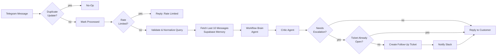

# Relay: A Self-Verifying AI Support Agent for Telegram

An n8n-built customer support bot that answers from a real knowledge base and live order data, **verifies every answer with a second, independent model before sending it**, and hands off to a human through a tracked Slack ticket when it can't help.


**Read the full write-up:** [Case study](docs/case-study.md) · [PDF version](docs/case-study.pdf)

---

## What it does

- **Answers only from evidence.** The agent can use exactly four tools (knowledge-base search, order lookup, open-ticket check, structured output). It is not allowed to answer from general knowledge.
- **Checks its own answers.** A separate Critic model re-checks each draft against the same evidence and can approve it, rewrite it, or force an escalation.
- **Escalates with a tracked ticket.** Unresolved conversations are posted to Slack with full context, and a teammate closes them with `/resolve-ticket <id>`, with no separate admin panel.
- **Built for messy real traffic.** Duplicate webhook deliveries, per-user rate limiting, retries, and fail-safe replies mean the customer is never left in silence.

## Architecture



One n8n workflow (`RELAY`) with two entry points:

1. **Conversation pipeline** (Telegram trigger): dedup, rate limit, memory, Brain, Critic, save conversation, then reply or escalate.
2. **Ticket resolution** (webhook): the Slack `/resolve-ticket <id>` slash command updates the ticket in Supabase and confirms back in Slack.

## Tech stack

| Layer | Tool |
|---|---|
| Orchestration | n8n |
| LLM inference (Brain and Critic) | Groq (`gpt-oss-120b`) |
| Embeddings | Google Gemini |
| Vector store (knowledge base) | Pinecone |
| Database (memory, orders, tickets, dedup, rate limits) | Supabase (Postgres) |
| Customer channel | Telegram Bot API |
| Human handoff | Slack API and slash commands |

## Repository structure

```
.
├── README.md
├── docs/
│   ├── case-study.md
│   ├── case-study.pdf
│   └── images/               # workflow screenshots used in the case study
├── sql/
│   ├── schema.sql            # tables, indexes, row level security
│   ├── seed_sample_data.sql  # fake orders for testing
│   └── maintenance.sql       # cleanup + operations queries
└── workflows/
    └── RELAY.json            # exported n8n workflow (credentials removed)
```

## Setup

### Prerequisites

- An n8n instance reachable over public HTTPS (n8n Cloud, or self-hosted behind a domain or tunnel), so Telegram and Slack can reach your webhooks
- A Supabase project
- A Pinecone account
- A Groq API key and a Google AI (Gemini) API key
- A Telegram bot (create one with [@BotFather](https://t.me/BotFather))
- A Slack workspace where you can create an app

### 1. Create the database

Open the Supabase **SQL editor** and run:

```
sql/schema.sql          -- required
sql/seed_sample_data.sql -- optional, adds fake orders for testing
```

The schema creates five tables: `processed_updates`, `rate_limits`, `chat_memory`, `orders`, and `follow_up_tickets`. Use the Supabase **service_role** key in n8n and never expose it client-side. `schema.sql` also has an optional, commented-out block to enable row level security.

> The table and column names must match the Supabase nodes in the workflow. If you renamed anything, update `sql/schema.sql` to match.

### 2. Create the knowledge base

1. Create a Pinecone index whose **dimension matches the Gemini embedding model** you use in the n8n embeddings node. The workflow expects an index named `company-latest`; change the name in the Pinecone node if you use another.
2. Load your FAQ and policy content into the index (embedded with the same model).

### 3. Import the workflows

In n8n: **Workflows → Import from file**, then import `workflows/RELAY.json`.

### 4. Add credentials in n8n

| Credential | Used for |
|---|---|
| Telegram API (bot token) | Receiving messages and sending replies |
| Groq API key | Brain and Critic models |
| Google Gemini (PaLM) API key | Embeddings for knowledge-base search |
| Pinecone API key | Knowledge-base vector search |
| Supabase (URL and service_role key) | All database nodes |
| Slack | Posting escalation tickets |

After importing, open each node that needs one and select the matching credential.

### 5. Connect Slack

1. Create a Slack app and add a slash command named `/resolve-ticket`.
2. Set its request URL to the **production webhook URL** of the `Slack /resolve-ticket Command` node: `https://<your-n8n-host>/webhook/resolve-ticket`.
3. Install the app to your workspace, then set the channel in the `Notify Slack (Escalation)` node (it has no channel selected in the export).

### 6. Activate

Activate the workflows in n8n and send a message to your bot.

## Try it

| Send this | Expected behaviour |
|---|---|
| A policy or FAQ question | Answer grounded in the knowledge base, verified by the Critic |
| "Where is my order ORD-1001? My email is aanya.sharma@example.com" | Live order lookup (needs the sample data) |
| An order question without an email | The bot asks for the email before looking anything up |
| Something unrelated to support | A polite refusal |
| A question the bot can't resolve | Slack ticket created; the customer is told it was escalated |
| Send the escalated question again | No duplicate ticket and no second "escalating" message |
| `/resolve-ticket <id>` in Slack | Ticket marked resolved, with a confirmation in Slack |

## Results

Figures in the case study come from a **simulated test bench, not a live production deployment**. See the [case study](docs/case-study.md) for methodology and limitations.

## What I'd build next

- Replace the fixed 10-message memory window with summarized long-context memory
- Let the Critic request a third opinion on ambiguous cases instead of a binary approve or escalate
- Add re-ranking to knowledge-base retrieval, since Critic rejections were mostly weak vector matches rather than wrong ones

## Security notes

- Workflow exports must not contain credentials, API keys, webhook URLs, or pinned test data. Check before committing.
- Use the Supabase `service_role` key only inside n8n credentials.
- The order-lookup tool requires both order ID and email so one customer can't retrieve another's data.

## Author

Built by Akshat · [LinkedIn](https://linkedin.com/in/your-handle) · [GitHub](https://github.com/your-handle)
