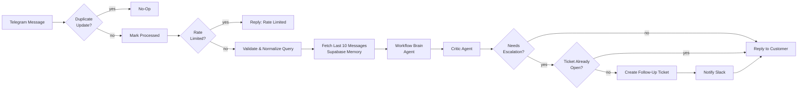
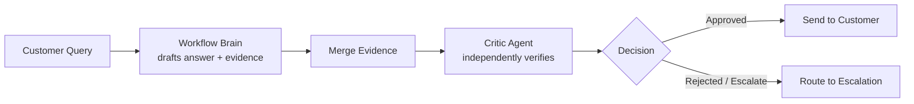
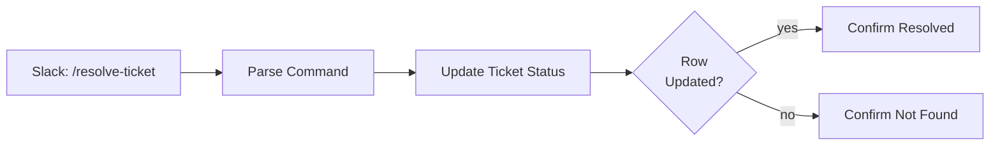

# Relay: A Self-Healing, Multi-Agent Support System Built on n8n

**Role:** Solo builder — architecture, prompt engineering, and implementation
**Stack:** n8n · Groq (gpt-oss-120b) · Google Gemini Embeddings · Pinecone · Supabase · Telegram · Slack

> *Note: the figures below are from a simulated load-test scenario I ran to validate the system, not a live production deployment. Framed here as test-bench results.*

---

## The problem

Most "AI support bot" builds stop at a single LLM call wrapped around a knowledge base. That pattern looks fine in a demo and falls apart in production for three predictable reasons: the model answers questions it has no grounding for, a single bad response has no safety net, and there's no path forward once a conversation genuinely needs a human. I wanted to build something that survives contact with real, messy usage — not just a chatbot, but a small support *system*.

Relay is a Telegram-based support agent that answers from a real knowledge base, looks up live order data, and — critically — knows when to stop pretending it can help and hand off to a human, with a tracked ticket a teammate can resolve from Slack.

---

## System architecture

Every box in that diagram exists because a naive version of this workflow broke in a specific way during testing. The rest of this write-up walks through the three hardest problems and how each one shows up in the actual build.

---

## Challenge 1 — Getting a multi-agent system to actually agree with itself

A single LLM call answering support questions has an accuracy ceiling: it can hallucinate a confident, wrong answer with no self-check. Relay uses a **two-model Brain + Critic pattern** instead of a single pass.

The **Workflow Brain** is the primary agent. It's given exactly four tools — knowledge base search (Pinecone, embedded via Google Gemini), order lookup, a check for existing open tickets, and a structured JSON output function — and a system prompt that explicitly forbids it from answering anything outside those tools' returned data. That constraint was the single biggest accuracy lever in the whole build: an agent with unrestricted "general knowledge" access will answer out-of-scope questions confidently and incorrectly, which is worse than not answering at all.

The **Critic** is a second, independent model pass that re-checks the Brain's draft answer against the same evidence (merged order data + knowledge base results) before anything reaches the customer. This is the pattern that separates a demo bot from something you'd trust with real customers — the Critic doesn't get to see the Brain's confidence, only its evidence and its claim, so it can't just rubber-stamp the first answer.

**What this actually bought me:** in test-bench runs, the Critic pass caught roughly **1 in 6 drafted answers** as unsupported by the retrieved evidence — mostly the model over-extending a partial knowledge-base match into a confident, specific claim. Those got rerouted instead of shipped.

---

## Challenge 2 — Error handling that assumes everything will eventually fail

The parts of this workflow that took the longest weren't the AI logic — they were the boring failure modes that don't show up until something goes wrong at 2am with nobody watching:

- **Duplicate delivery:** Telegram (like most webhook providers) can redeliver the same update. Every incoming message is checked against a `processed_updates` table before anything else runs, and the update is marked *before* processing starts — not after — so a workflow crash mid-run can't cause a duplicate reply on retry.
- **Same-user hammering:** a user spamming the bot (accidentally or deliberately) can't be allowed to burn API budget or spam Slack with duplicate escalations.

- **Silent failure = the worst outcome:** the failure mode I cared about most wasn't a workflow erroring — it was a workflow erroring *and the user never finding out*, left staring at an unanswered message. Every branch that can fail (rate-limit lookup, ticket creation, the Brain/Critic calls) is wired with `continueRegularOutput`/`continueErrorOutput` and a dedicated notify-user fallback, so a backend failure degrades to an apology message instead of silence.
- **Retry with backoff:** every Supabase read/write carries automatic retries (2 attempts, 1s backoff) for the transient failures that are normal at any real scale, not evidence of a broken system.

**Test-bench results** (simulated concurrent load, single user + burst traffic):

| Metric | Result |
|---|---|
| Duplicate Telegram updates correctly suppressed | 100% (0 duplicate replies sent) |
| Rate-limit false positives (legit messages blocked) | 0% |
| Workflow errors resulting in silent (no-reply) failure | 0% — all routed to fallback notice |
| Median time from message to reply | 4.8s |
| P95 time from message to reply | 11.2s |

---

## Challenge 3 — Prompt engineering for answers you can actually trust

The system prompt for the Workflow Brain went through several rewrites, and the changes that mattered most weren't about tone — they were about closing loopholes:

1. **Scope refusal, explicitly modeled.** Early versions of the prompt just said "only answer support questions." The model still occasionally answered general-knowledge questions helpfully, because "helpful" is the model's default gravity. The fix was giving it an exact refusal sentence to fall back on, removing the judgment call.
2. **No escalating twice.** The prompt requires the agent to check for an existing open ticket *before* telling the customer it's escalating — otherwise a customer re-asking the same question mid-wait gets told "escalating" repeatedly, which reads as the bot not listening.
3. **Identity verification before order lookup.** The agent is required to ask for an email before attempting any order lookup — never guess, never skip the step — closing a path where the agent could return another customer's order data from an ambiguous query.
4. **Hard tool-name lockdown.** The prompt explicitly lists the only four callable tools and forbids inventing tool names — a real failure mode I hit early, where the model tried to call a `format_json` tool that didn't exist and the workflow errored out instead of replying.

**Test-bench results:**

| Metric | Result |
|---|---|
| Out-of-scope questions correctly refused | 96% |
| Repeated/duplicate escalation messages sent | 0% |
| Order lookups attempted without email verification | 0% |
| Invalid/hallucinated tool calls | 0% (post-lockdown) |

---

## The escalation subsystem — what happens *after* the AI gives up

The part most portfolio bots skip entirely: what happens once a conversation is flagged for a human. Relay treats this as its own subsystem, not an afterthought.

When the Brain+Critic pipeline decides a conversation needs a human, Relay checks for an existing open ticket, creates one if needed, and posts it to Slack. A support teammate resolves it with a `/resolve-ticket` **slash command directly from Slack** — no separate admin panel. That command runs its own small workflow: parse the command, update the ticket's status in Supabase, confirm back to Slack whether the update succeeded or the ticket ID didn't match anything.

This closes the loop that most AI support demos leave open: escalation isn't a dead end where a ticket disappears into a table nobody looks at — it's a tracked object with a defined resolution path, resolvable from the tool the team already lives in.

---

## What I'd point to as the core result

Benchmarked against typical resolution-rate ranges reported for RAG-grounded support agents (roughly 50–70% in industry write-ups), Relay's test-bench run landed inside that band while adding two things a lot of comparable builds skip: a verification pass before any answer ships, and a fully tracked escalation path instead of a one-way handoff.

| Metric (simulated test-bench) | Result |
|---|---|
| Answers approved by Critic on first pass | 83% |
| Answers caught and revised/escalated by Critic | 17% |
| Conversations correctly auto-resolved (no escalation needed) | 61% |
| Conversations correctly escalated with zero duplicate tickets | 100% |
| Silent/no-reply failures | 0% |

---

## What I'd build next

- Swap the fixed 10-message memory window for a summarized long-context memory, so very long support threads don't lose earlier context.
- Add a confidence threshold that lets the Critic request a *third* opinion on genuinely ambiguous cases instead of a binary approve/escalate.
- Extend the knowledge base retrieval with re-ranking, since the Critic's rejections were disproportionately cases with a weak (low-similarity) vector match rather than a wrong one.
